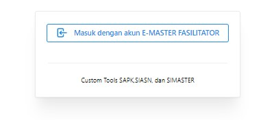
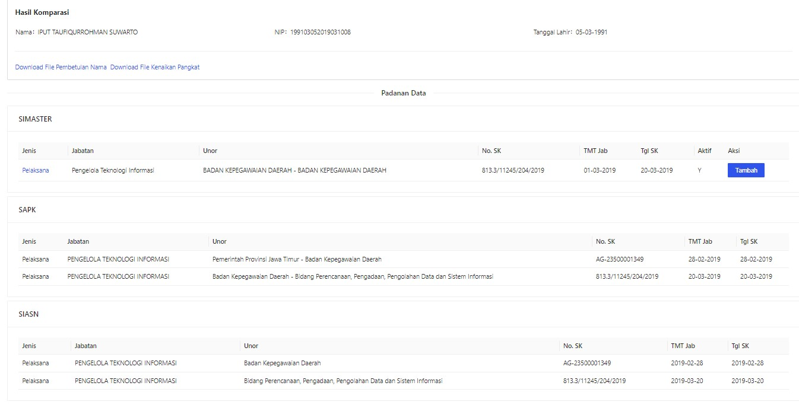
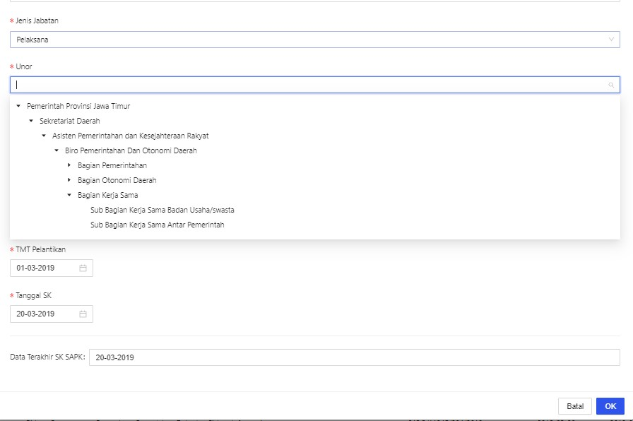

# Custom Tools
Aplikasi untuk melihat perbandingan data pegawai SIMASTER (Simpeg Daerah), SAPK, dan SIASN. Digunakan untuk mempercepat pembetulan UNOR untuk kebutuhan kenaikan Pangkat/pembetulan nama. Menggunakan Microservice SIASN, SAPK, dan SIMPEG dan SSO

# Framework
- NextJS
- NextAuth
- Antd
- ZLib
- xlsx

# Fitur
- Menampilkan data Simpeg,SIASN dan SAPK dilakukan untuk pembetulan nama
- Download file pembetulan nama (sk pangkat terakhir, ijazah pendidikan CPNS, dan sk cpns)

